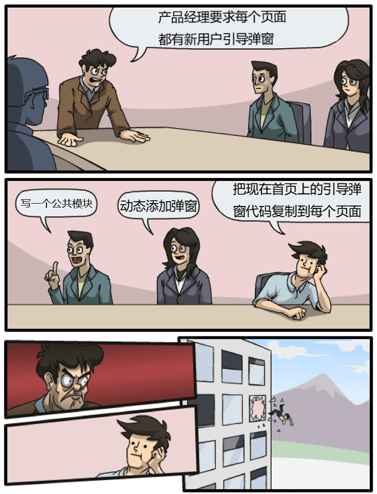

# 使用VirtualModuleWebpackPlugin减少mpvue小程序开发下套路代码copy

## 背景介绍

> copy代码是一个快速提高代码数量和降低代码质量的精妙操作，长期以来处于各路鄙视链的底端。但有时面对一些套路代码又别无他法，每当看到项目中那些不得已而为之的套路代码，我心中都会泛起卿本佳人奈何做贼的伤痛。



因为后面提到的套路代码主要和mpvue有关，所以这里先介绍一下和mpvue相关背景。

微信小程序自诞生之日起，就有无数仁人志士前仆后继想要为它带来现代化的开发体验，[mpvue](http://mpvue.com/mpvue/)是其中一个兼容vue语法的小程序开发框架，在mpvue下，一个页面由以下文件构成：

```text
PageX/
├── PageX.vue // 页面对应的vue组件
└── main.js // 构建的entry入口
```

mpvue把每个小程序页面作为一个webpack的entry构建，所以每个页面下都需要由一个main.js作为entry入口，其内容大致如下

```javascript
import Vue from 'vue'
import App from './PageX.vue'
const app = new Vue(App)
app.$mount()
```

很显然，这是一个充斥着套路代码的js文件，每次新建页面都需要copy一个这样的套路文件不仅有些繁琐，更让人担心日后如果main.js需要添加其他内容，是否又会需要一一手动修改。

那是否有办法可以实现页面下不需要存在main.js文件而构建时webpack假装它存在并将其加入构建呢？我将需求描述的如此清楚是时候有个程序员来实现它了，虽然听起来像是要造一个三角月饼一般。

终于在某个风(不)和(用)日(干)丽(活)的上午，作为一名有着丰富~~google~~经验的前端工程师，我决定~~写一个工具~~找找现成的npm包来解决这个问题。最终我发现了[virtual-module-webpack-plugin](https://github.com/rmarscher/virtual-module-webpack-plugin)这个webpack插件。

现行通行的由webpack项目下，src下的代码最终是否会出现在dist目录并不完全取决于某个文件or模块是否被import，比如使用ContextReplacementPlugin来精简moment下的locale。webpack就像负责向皇帝呈递奏章的小太监，中间偷偷把大臣的奏章撕掉一页是完全可能的，只要最后皇帝读起来没有发现上下文丢了内容。所以聪明如康熙，“传位十四子”的遗诏同时提供了满文版的checksum，避免了“传位于四子”这样的中间人攻击。

话说回来，既然小太监可以把奏折偷偷撕掉一页，那假冒某个大臣替它上一份得罪皇帝的折子惹他个株连九族也未必不可能，只要这个小太监具备足够的文化水平和笔迹模仿能力。

webpack自身并没有提供这一骚操作，这也是科学的，如果eslint辛辛苦苦将disable-dynamic-require的代码交给了webpack，而webpack转身就往里面添加了一堆unexists-code，那真是像极了将分类垃圾桶里的垃圾倒入了一辆垃圾车中。

VirtualModuleWebpackPlugin做到了这点，它通过魔法操作实现了把不存在的文件(fs.exists意义上的不存在，我暂时把它称为virtual文件)加入构建。

> It uses private APIs of the CachedInputFileSystem of the enhanced-resolve package that Webpack uses as the module resolver. Therefore, it is inherently fragile and subject to be broken if the CachedInputFileSystem changes. Fortunately, the changes have not been too extensive between webpack 1.x - 4.x and this plugin has been updated to be compatible with all.

它使用了webpack的未开放api，将virtual文件作为缓存来欺骗webpack的resolve，虽然相关api可能会随着webpack升级而不可用，但目前来看这个问题并不需要特别担心，尤其是mpvue还停留在webpack3时代止步不前的情况下。

现在锤子已经就绪，便只差一个钉子来试试手。我创建了[repo](https://github.com/EAGzzyCSL/patron-saint-demo)记录了使用VirtualModuleWebpackPlugin改造mpvue项目全过程可供参看，且下面的文章内容会随commit一一增加。

## 初始化一个mpvue项目

> 我为这个项目起了一个名字：PatronSaint，后面会解释命名的由来。

### 套路三连

使用官方提供的mpvue-quickstart模板：

```bash
vue init mpvue/mpvue-quickstart patron-saint-demo
cd patron-saint-demo
npm install
```

### 小调整

mpvue官方模板生成的项目还不能够直接运行，需要做一点小调整：

- 填入从微信开发者给的touristappid: `wx492a011c5ecda41d`

- 删掉app.json中的tabBar字段，因为项目里其实没有tab页面。

### 删除无关代码

通过模板生成的项目中有一些组件和utils方法是做示例之用，这里将它们都删掉使页面保持最小以方便改造。

### 修改页面命名

微信小程序官方示例中页面路径都是`pages/Index/Index`格式，而mpvue下使用了`pages/index/main`格式。命名本身无大所谓，不过如果将来项目放弃mpvue框架转而使用原生开发，为了兼容旧有得页面路径，`pages/index/main`这种格式下代码文件的组织就会充斥着main。

```text
pages
├── index
│   ├── main.js
│   ├── main.json
│   ├── main.wxml
│   └── main.wxss
└── mine
    ├── main.js
    ├── main.json
    ├── main.wxml
    └── main.wxss
```

这对代码的快速定位非常不友好，所以我更倾向官方示例中得`pages/Index/Index`格式，且由于vue组件名通常为是PascalCase，所以这里需要重命名index.vue为Index.vue

### 添加第二个页面

只有一个页面的情况下不存在copy套路代码的问题，所以再添加一个页面`Mine`以供测试。

因为前面修改了页面路径的格式，所以魔改了一下`webpack.base.conf.js`中的`pagesEntry`逻辑，理论上app.json也可由构建时生成，但这个不是重点所以选择手动修改。

## 使用VirtualModuleWebpackPlugin消灭main.js

安装`virtual-module-webpack-plugin`

```bash
npm install virtual-module-webpack-plugin --SD
```

### 使用方法

```javascript
plugins: [
  new VirtualModulePlugin({
    // 一个src下根本不存在的virtual文件
    moduleName: 'src/mysettings.json',
    // 你希望这个virtual文件的内容是什么
    contents: JSON.stringify({ greeting: 'Hello!' })
  })
]
```

基本的使用方法如上，此外contents还可以为一个对象或者时function。

通常情况下，如果构建时引用了不存在的模块则会导致webpack报错，更别提使用不存在的文件作为entry，而VirtualModulePlugin的作用便是欺骗webpack该文件是存在的，且内容为`...`。

### 干掉main.js

(main.js只是用来代指每个页面下的入口js文件，由于mpvue构建后的页面路径由main.js的文件名决定，所以为了实现`/pages/Index/Index`格式的路径，main.js需要在每个页面下重命名为对应页面的名字)

对`webpack.base.conf.js`做如下修改

```javascript
const VirtualModuleWebpackPlugin = require('virtual-module-webpack-plugin')

// 在plugins中添加
...pages.map(pageName => new VirtualModuleWebpackPlugin({
  moduleName: `./src/pages/${pageName}/${pageName}.js`,
  contents:
`import Vue from 'vue'
import App from './${pageName}.vue'
const app = new Vue(App)
app.$mount()
`,
```

之所以缩进这么奇怪是因为webpack被VirtualModuleWebpackPlugin欺骗，认为这就是一个正常得代码文件，所以相关的eslint插件依然会对它做lint检查。

通过上面的配置，`Index.js`和`Mine.js`在构建中已经由VirtualModuleWebpackPlugin负责提供，因此可以删掉真实文件系统中的`Index.js`和`Mine.js`，并执行`npm start`进行测试。

如果webpack没有报错且构建后的代码可以正常运行，那么删掉main.js的目标至此达成。

由此可以发现VirtualModuleWebpackPlugin十分适合解决webpack多entry构建且每个entry入口文件雷同情况下需要copy多个入口文件的场景。但需要注意的是，由于VirtualModuleWebpackPlugin是通过将virtual文件作为缓存提供给webpack，因此**virtual文件的变动并不会触发webpack的更新**，但实际开发中入口文件变动频率极低，所以这一问题可以忽略之。

## 将virtual文件从webpack配置中独立

直接在plugin定义中声明contents虽然简单直观，但缩进和后续的维护都不方便，因此可以通过一些辅助方法将它作为独立的js文件。

新建`pageEntry.virtual`和`replacer`文件：

```text
src/patronSaint/
├── pageEntry.virtual.js
└── replacer.js
```

pageEntry的内容即为main.js内容的模板，文件名中添加了`.virtual`以区分于普通文件。

```javascript
import Vue from 'vue'
import App from './$PAGE_NAME$.vue'
const app = new Vue(App)
app.$mount()
```

`$PAGE_NAME$`是我临时定义的一种模板语法，为了方便查找替换。

replacer负责执行模板的替换：

```javascript
var fs = require('fs')

module.exports = (fileName, options = {}) => {
  try {
    const sourceCode = fs.readFileSync(`${__dirname}/${fileName}.js`, 'utf-8')
    return Object.entries(options).reduce(
      (targetCode, [origin, target]) =>
        targetCode.replace(new RegExp(`\\$${origin}\\$`, 'g'), target),
      sourceCode
    )
  } catch (e) {
    console.error(e)
  }
  return ''
}
```

修改`webpack.base.conf.js`：

```javascript
const replacer = require('../src/patronSaint/replacer')

...pages.map(pageName => new VirtualModuleWebpackPlugin({
  moduleName: `./src/pages/${pageName}/${pageName}.js`,
  contents: replacer('pageEntry.virtual.js', {
    PAGE_NAME: pageName,
  }),
})),
```

再次执构建，一切ok。

至此VirtualModuleWebpackPlugin便可以很方便在项目中使用，独立的virtual文件后续的维护与修改和普通js文件体验基本相同。

## 探索使用virtualModulePlugin实现更多功能

> 前文所述，只是为了替换一个仅几行的js文件，铺垫之长，操作之繁，实际仅仅减少了有限的代码，还留下了PatronSaint这样一个奇怪名字，且标题所说为减少套路代码，实际却时减少套路文件，大有标题党与为virtual而virtual之嫌。

是的，如果仅是面对重复的main.js，不引入这一套操作而选择保持现状，并不会有太大的问题，与前面所说一致，入口文件的变动频率极低。

但实际使用mpvue开发小程序时，还会遇到别的套路代码，回到开头的那张漫画中的需求场景。


这个需求是我现编的，实际的新用户引导会如何表现我是并不了解的。

虽然短袖青年被从楼上丢了下来，但在小程序中，这几乎是唯一的方案，只不过是可以把copy全部代码改为copy一个组件，本质还是离不开copy。因为小程序是没有dom能力的，动态添加dom是无法实现。

### 没有dom能力的小程序

前面说了，小程序是没有dom能力的🤷‍，意味着所有元素都要在编译时写入wxml模板中(摔！)，妈妈再也不用担心我记不住`document.createDocumentFragment`一系列api了🙂。

乍一看似乎并不会有什么大问题，细一想如果没有dom能力则意味着传统的自定义dialog，toast等想法都成为了泡影，因为各类ui库中的toast等弹出都是通过动态添加元素来实现的。

当然，小程序提供了原生的toast与dialog支持，但原生的可定制化程度低，涵盖场景少，比如toast最多只能显示7个字（现在扩展到两行了，不过得是不显示icon的情况下），就像下面这样子🤷‍。


对此的解决方案就便是实现自定义的toast，因为无法动态添加元素，所以对于每个页面都事先把toast的标签写入页面中，当然如果这个页面不需要toast的展示那可以例外，但谁知道将来会不会有呢。

```html
<div class="page-xxx">
  <!-- code of page -->
  <customer-toast
    v-if="showToast"
  />
</div>
```

toast没有交互所以代码较少，而dialog因为包含确认/关闭等操作会带来更多的代码，这些代码如果需要在每个页面之间copy，无疑是后期维护的带来灾难。

或许自定义toast和dialog可以算作一种伪需求，且毕竟不是所有的页面都需要弹窗，但在微信小程序中如果选择了自定义导航栏则一定要把自定义导航栏的代码在每个页面中copy一份，这是由自定义导航栏的实现机制决定的。

### 寻找解决方案

借鉴一下高阶组件的玩法，其实就是搞个slot，定义一个`<father-of-page>`的组件，它内含了自定义的导航栏，并提供默认的slot用于展示页面内容，那么一个新的小程序页面只需这样创建即可：

```html
<template>
  <father-of-page
    @search="handleSearch"
  >
    <div class="page">
      content of page
    </div>
  </father-of-page>
</template>
<script>
export default {
  methods: {
    handleUpLoadDone() {
      this.$emit('show-toast', 'upload done')
    }
  },
}
</script>
```

页面内容包裹在father-of-page下，toast，navgation等逻辑全部由father-of-page负责，页面需要toast的时候只需要向它的父级报告，就像这样:


错了，是这样:


而导航栏上的交互，如导航栏上搜索框的回调事件等则由father-of-page将事件抛出交由页面处理。

这种模式下，虽然每个页面还需要有少量套路代码，但基本解决了前面的大量copy代码问题，不过依然无法应对后期导航栏和页面扩展更多交互的需求。

又很不幸的是，mpvue对于slot的支持非常糟糕，所以这种方案需要做一定的变通：

```html
<template>
  <div class="page-wrapper">
    <father-of-page
      @search="handleSearch"
    />
    <div class="page">
      content of page
    </div>
  </div>
</template>
```

多增加了一个外层包裹的div和对应的css，重复量正在趋于不可接受。

### 使用VirtualModuleWebpackPlugin将页面分离

回到VirtualModuleWebpackPlugin，只要想办法把套路代码抽离到一个文件中，那就可以将它作为virtual文件加入构建。

如果对每个页面我们只关注页面自身的私有逻辑，那么页面便可以作为一个单独的组件。

而被main.js挂载的页面，姑且称为“页面爸爸”，内容如下：

```html
<template>
  <div class="page-wrapper">
    <father-of-page
      @search="handleSearch"
    />
    <page-a $ref="page"/>
  </div>
</template>
<script>
export default {
  methods: {
    handleSearch() {
      if (this.$refs.page.handleSearch) {
        this.$refs.page.handleSearch
      }
    }
  }
}
</script>
```

作为独立组件的页面内容部分：

```html
<template>
  <div class="page">
    content of page
  </div>
</template>
<script>
export default {
  methods: {
    handleSearch() {
      // ...
    }
  }
}
</script>
```

可以看到，每个页面的“页面爸爸”之间除了引用的page组件不同外，其余部分都是相同的，所以具备了作为virtual文件的可行性。

不过“页面爸爸”这个名字太过直白又不那么高大上，所以我取了PatronSaint（守护神的意思）这个名字，同样以p开头且具有相同的意思，就像唐僧取西经时围在头上的五方揭谛，六丁六甲、一十八位护教伽蓝一般，孙悟空被困黄眉怪的金饶中无奈下只能给揭谛emit了一个事件着其向玉帝求救。

下面将通过实现navigation来完成页面与patronSaint分离。

### 安装一下sass

由于后面要写css了，所以先安装一下sass

```bash
npm install node-sass sass-loader --SD
```

mpvue的模板是有sass的对应配置的，但package.json中并没有把它作为依赖，所以这里安装后无需配置即可使用。

### 实现navigation

首先在app.json的window下添加如下配置以允许使用自定义导航栏

```json
"navigationStyle": "custom"
````

添加`PatronSaint.virtual.vue`文件，它将作为每个页面的根组件

```html
<template>
  <div class="patron-saint">
    <div class="nav">简陋的自定义的导航栏</div>
    <$KEBAB_PAGE_NAME$ />
  </div>
</template>

<script>
import $PAGE_NAME$ from './$PAGE_NAME$.vue'

export default {
  components: {
    $PAGE_NAME$
  }
}
</script>
<style>
.nav {
  display: flex;
  justify-content: center;
  align-items: center;
  height: 4em;
  color: white;
  background-color: gray;
}
</style>
```

对应在webpack.base.conf需要中添加如下内容:

```javascript
...pages.map(pageName => new VirtualModuleWebpackPlugin({
  moduleName: `./src/pages/${pageName}/PatronSaint.vue`,
  contents: replacer('PatronSaint.virtual.vue', {
    PAGE_NAME: pageName,
    KEBAB_PAGE_NAME: kebabCase(pageName),
  }),
}))
```

同时由于PatronSaint作为了根组件，pageEntry.virtual.js中也需要做对应修改:

```diff
- import App from './$PAGE_NAME$.vue'
+ import App from './PatronSaint.vue'
```

webpack.base.conf中也做同样改动:

```javascript
...pages.map(pageName => new VirtualModuleWebpackPlugin({
  moduleName: `./src/pages/${pageName}/${pageName}.js`,
  contents: replacer('pageEntry.virtual.js'),
})),
```

再次`npm start`，可以看到每个页面都在自身毫无改动的情况下拥有了一个自定义的导航栏，如果后续有与导航栏相关的交互逻辑，只需要添加相应事件的响应方法即可。

这种改进版方案不解决了套路代码的copy，同时也可以从容应对后期的扩展，添加新的全局弹窗等各种只需要在PatronSaint.virtual.vue中操作，而不需要为此对每个页面做逐一修改。

### 实现toast与dialog

基于前面navigation的思路，可以很快实现全局的toast和dialog，这里不再赘述，大概代码如下，详细代码可以参看对应的commit。

```html
<template>
  <div class="index">
    <span>this is page index</span>
    <button
      @click="handleToMine"
    >to page Mine</button>
    <button
      @click="handleShowToast"
    >show toast</button>
    <button
      @click="handleShowDialog"
    >show Dialog</button>
  </div>
</template>

<script>
import PatronSaintFactory from '@/patronSaint/PatronSaintFactory'

export default PatronSaintFactory({
  methods: {
    handleToMine () {
      wx.navigateTo({
        url: '/pages/Mine/Mine'
      })
    },
    handleShowToast () {
      this.$ps.showToast({
        title: 'this is a toast'
      })
    },
    handleShowDialog () {
      this.$ps.showDialog({
        title: 'PatronSaint Dialog',
        content: 'this is a dialog'
      })
    }
  }
})
</script>
```

commit中的代码中还实现了一个全局的登录器，保障用户登录后（获取token后）才挂载页面，如果登录失败则展示重新登录按钮，这样页面只需要维护纯自身的逻辑而不再关心登录相关操作。

### scroll

wip
